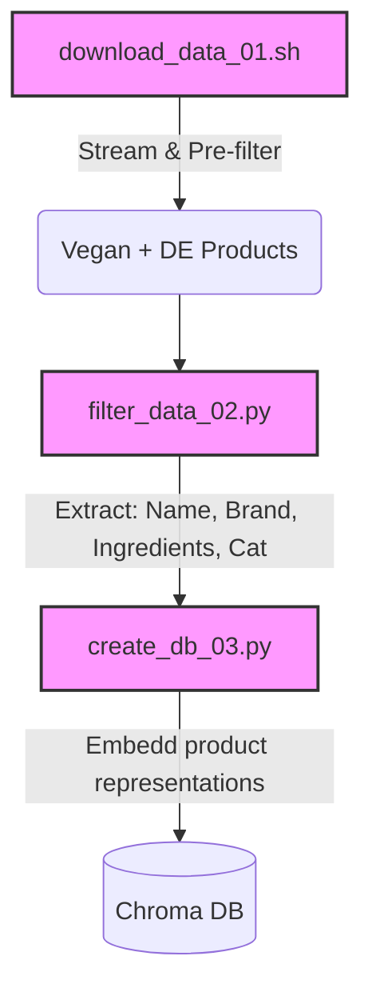
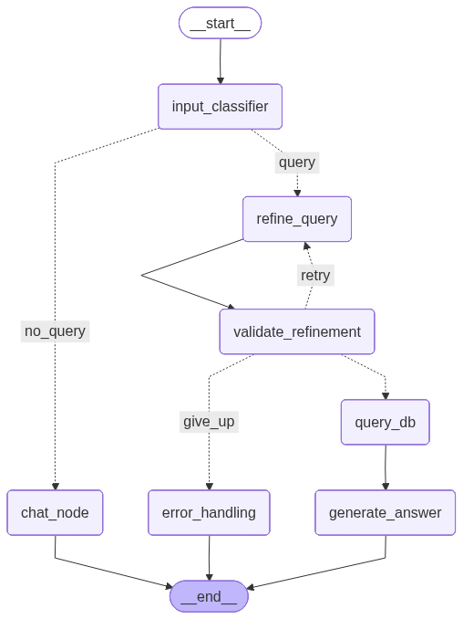

# 🌿🔗 V-Chain-DE

**Status: 🛠️ Under Development / Prototype**

A RAG (Retrieval-Augmented Generation) chatbot that provides precise information on vegan German food products based on a subset of the [**Open Food Facts**](https://openfoodfacts.org) database.

## 🎯 Purpose of this Project

The purpose of this project is to help find plant-based food products that are sold in Germany. The idea is that an LLM like Claude Sonnet is augmented with a subset from the data of the **Open Food Facts** (OFF) database to reduce hallucinations and the LLM, on the other hand, could use its world knowledge to clarify in case the vegan status ascertained by OFF is doubtful.[^1] E.g. there can be [products with meat flavor](https://de.openfoodfacts.org/produkt/8801073110502/buldak-hot-chicken-black-samyang) labeled as vegan in OFF and a powerful LLM would be able to dissect the ingredients and give additional information on the vegan status of those ingredients. For example, the generic ingredient "flavor" (_Aroma_ in German) can contain non-allergenic animal-derived components without explicit labeling.

## ⚠️ Safety & Reliability Disclaimer

This project is an AI-powered search tool using **Retrieval-Augmented Generation (RAG)** based on [Open Food Facts](https://openfoodfacts.org) data. Please read the following carefully before using the information provided:

### 1. Data Source Limitations (Open Food Facts)
*   **Crowdsourced:** Data is contributed by users and may contain manual entry errors or outdated information.
*   **OCR Errors:** Ingredients are often scanned via Optical Character Recognition (OCR), which can misinterpret characters (e.g., missing a comma or misreading an allergen).
*   **Reformulations:** Manufacturers change recipes frequently; the database may not reflect the specific version of the product you have in hand.

### 2. AI & LLM Limitations (RAG)
*   **Hallucinations:** Large Language Models (LLMs) can confidently generate false information. Even if the underlying data is correct, the AI may misinterpret or "invent" details during the generation process.
*   **Synthesis Risk:** The AI might overlook critical "may contain" traces or fail to distinguish between a "free-from" marketing claim and the actual legal ingredient list.

### 3. Final Warning
**This tool is NOT a medical or clinical device.** If you have a life-threatening allergy or strict dietary requirement, **always verify the physical label on the product packaging.** The developers and data providers assume no liability for any adverse reactions, inaccuracies, or reliance on the information provided by this bot.

## 🛤️ Data Pipeline

1. `download_data_01.sh`: Streams and pre-filters the data from the [JSON dump](https://static.openfoodfacts.org/data/openfoodfacts-products.jsonl.gz) to only include vegan food products sold in Germany.
2. `filter_data_02.py`: Filters the data further by only extracting relevant information: Name of the product, brand name(s), ingredients and categories.
3. `create_db_03.py`: Builds the Chroma database.



### Data Customization

The repository includes a pre-built **ChromaDB** containing the processed German food data, so you can start querying immediately. However, if you wish to filter the **OpenFoodFacts** data differently (maybe for a different country) or include additional fields, you can modify and run the data pipeline.

## 🏗️ Architecture & Graph Logic

The chatbot's decision logic is orchestrated via **LangGraph**, utilizing a state-based workflow:

*   **Input Classification:** An entry node determines if the user input is a product search, a general interaction or a follow-up question not involving a query.
*   **Query Refinement:** A dedicated node optimizes the raw user query into a search-friendly string for ChromaDB. It uses Pydantic to ensure a consistent output format.
*   **Validation Node:** A node verifies whether the refinement was successful.
    *   **Self-Correction Loop:** If validation fails, the graph edges back to the refinement node.
    *   **Retry Logic:** A counter limits the loop to **three attempts** before the process terminates or proceeds to the next state.
*   **Query DB Node**:  A node that handles the querying of the Chroma database. Uses re-ranking to increase context precision.
*   **Generate Answer**: This node uses the context provided by the vector search to answer the user query.
*   **Persistence:** Integrated **checkpointers** save the graph state, enabling multi-turn conversations and full session recovery.



## 🌐 Language & Taxonomy

Although this project focuses on **food products sold in Germany**, the chatbot is designed to be queried in **English**. 

**Why English?**
The system utilizes the **English ingredient and category taxonomy** from OpenFoodFacts for indexing and retrieval. This ensures more reliable metadata mapping and consistent vector search results, as the English taxonomy is currently the most comprehensive and standardized within the dataset.

## 🚀 Features

- **Query Classification:** Automatically detects whether the user is asking about a product or just engaging in "small talk" or has a follow-up question about the product not involving another query.
- **Autonomous Refinement Loop:** Automatically refines user queries for optimized vector search.
- **Pydantic Validation:** Ensures reliability by structuring and validating search parameters through Pydantic models.
- **Reranking:** Implements a reranker to refine search results, increasing context precision for the LLM.
- **Gradio UI:** A user-friendly chat interface for interaction with the food agent.

## 🗺️ Roadmap / Future Improvements

This project is currently in the **prototype phase**. Planned enhancements include:

- [ ] **Prompt Engineering**: Revise the prompts for better results.
- [ ] **Asynchronous Execution:** Refactor LangGraph nodes to use async/await patterns to reduce latency and handle I/O-bound tasks concurrently.
- [ ] **RAGAS Evaluation:** Implement an automated evaluation pipeline to measure faithfulness and relevance.
- [ ] **Metadata Filtering:** A mechanism to filter by specific brands or categories (e.g., "Organic/Bio" only) and handle negations (e.g. "no peanuts").
- [ ] **Hybrid Search:** Combining semantic vector search with keyword matching for better brand name accuracy.

## 🛠️ Installation & Setup

### Prerequisites
- **Git LFS** (Required to download the pre-built Chroma DB)
- **Docker** and **Docker Compose**
- **Anthropic API Key**

### Setup Steps

1. **Clone the repository:**
   ```bash
   git clone git@github.com:rafehr/v-chain-de.git
   cd v-chain-de
   ```

2. **Configure the environment**

    Create an `.env` file and add this:

    ```CLAUDE_API_TOKEN=your_api_key_here```

3. **Build and start the application**

    ```bash
    docker compose up --build
    ```
4. **Access the chat interface**:

    Go to `http://localhost:7860/`in your browser.

## 📂 Project Structure

```text
├── food_agent/             # Core Logic
│   ├── agent.py            # LangGraph workflow definition
│   └── utils/              # Node functions, prompts, schemas & vectorstore setup
├── scripts/                # Data Pipeline (Download -> Filter -> Embedding)
├── data/                   # Raw & processed OpenFoodFacts JSONL files
├── off_db/                 # Persistent ChromaDB vector store
├── tests/                  # Pytest suite for parsers and logic
├── app.py                  # Main entry point (CLI or API)
└── docker-compose.yaml     # Container orchestration
```

## 🛠 Tech Stack

- **Framework:** [LangChain](https://langchain.com) & [LangGraph](https://www.langchain.com/langgraph)
- **Database:** [ChromaDB](https://trychroma.com) (Vector Store)
- **UI:** [Gradio](https://gradio.app)
- **Data Source:** [Open Food Facts (JSONL Dump)](https://world.openfoodfacts.org/data)
- **Infrastructure:** Docker & Docker Compose

## Licensing

- **Software:** The code in this repository is licensed under the [MIT License](LICENSE).
- **Data:** This project uses data from [Open Food Facts](https://openfoodfacts.org), which is licensed under the [Open Database License (ODbL)](https://opendatacommons.org). 
  Any derivative database created from this data must also be released under the ODbL.

## Acknowledgments
- Data provided by [Open Food Facts](https://openfoodfacts.org) (ODbL).
- Built with [LangGraph](https://www.langchain.com/langgraph) and [Gradio](https://gradio.app).

## Footnotes

[^1]: Since OFF is a crowdsourced project, it may contain errors (see Safety & Reliability Disclaimer below).
