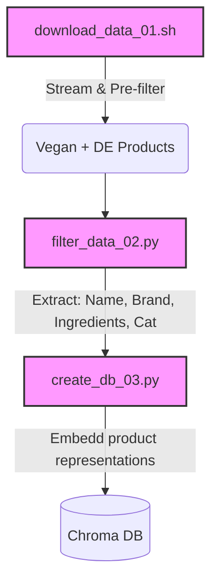

# 🌿🔗 V-Chain-DE

Status: 🛠️ Under Development / Prototype

A RAG (Retrieval-Augmented Generation) chatbot that provides precise information on vegan German food products based on a subset of the [**Open Food Facts**](https://openfoodfacts.org) database.

## 🎯 Purpose of this Project

The purpose of this project is to help find plant-based food products that are sold in Germany. The idea is that an LLM like Claude Sonnet is augmented with a subset from the data of the **Open Food Facts** (OFF) database to reduce hallucinations and the LLM, on the other hand, could use its world knowledge to clarify in case the vegan status ascertained by OFF is doubtful.[^1] E.g. there can be [products with meat flavor](https://de.openfoodfacts.org/produkt/8801073110502/buldak-hot-chicken-black-samyang) labeled as vegan in OFF and a powerful LLM would be able to dissect the ingredients and give additional information on the vegan status of those ingredients. For example, the generic ingredient "flavor" (_Aroma_ in German) can contain non-allergenic animal-derived components without explicit labeling.

## ⚠️ Safety & Reliability Disclaimer

This project is an AI-powered search tool using **Retrieval-Augmented Generation (RAG)** based on [Open Food Facts](https://openfoodfacts.org) data. Please read the following carefully before using the information provided:

### 1. Data Source Limitations (Open Food Facts)
*   **Crowdsourced:** Data is contributed by users and may contain manual entry errors or outdated information.
*   **OCR Errors:** Ingredients are often scanned via Optical Character Recognition (OCR), which can misinterpret characters (e.g., missing a comma or misreading an allergen).
*   **Reformulations:** Manufacturers change recipes frequently; the database may not reflect the specific version of the product you have in hand.

### 2. AI & LLM Limitations (RAG)
*   **Hallucinations:** Large Language Models (LLMs) can confidently generate false information. Even if the underlying data is correct, the AI may misinterpret or "invent" details during the generation process.
*   **Synthesis Risk:** The AI might overlook critical "may contain" traces or fail to distinguish between a "free-from" marketing claim and the actual legal ingredient list.

### 3. Final Warning
**This tool is NOT a medical or clinical device.** If you have a life-threatening allergy or strict dietary requirement, **always verify the physical label on the product packaging.** The developers and data providers assume no liability for any adverse reactions, inaccuracies, or reliance on the information provided by this bot.

## 🛤️ Data Pipeline

## 🛠 Tech Stack

- **Framework:** [LangChain](https://langchain.com) & [LangGraph](https://www.langchain.com/langgraph)
- **Database:** [ChromaDB](https://trychroma.com) (Vector Store)
- **UI:** [Gradio](https://gradio.app)
- **Data Source:** [Open Food Facts (JSONL Dump)](https://world.openfoodfacts.org/data)
- **Infrastructure:** Docker & Docker Compose

## Licensing

- **Software:** The code in this repository is licensed under the [MIT License](LICENSE).
- **Data:** This project uses data from [Open Food Facts](https://openfoodfacts.org), which is licensed under the [Open Database License (ODbL)](https://opendatacommons.org). 
  Any derivative database created from this data must also be released under the ODbL.

## Acknowledgments
- Data provided by [Open Food Facts](https://openfoodfacts.org) (ODbL).
- Built with [LangGraph](https://www.langchain.com/langgraph) and [Gradio](https://gradio.app).

## Footnotes

[^1]: Since OFF is a crowdsourced project, it may contain errors (see Safety & Reliability Disclaimer below).
